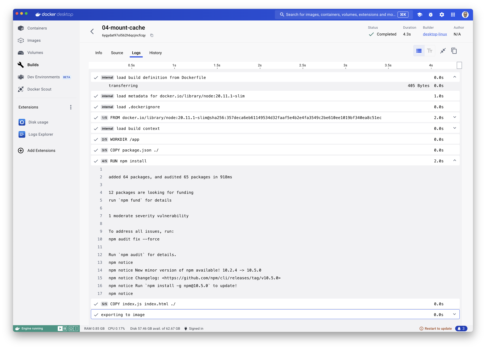
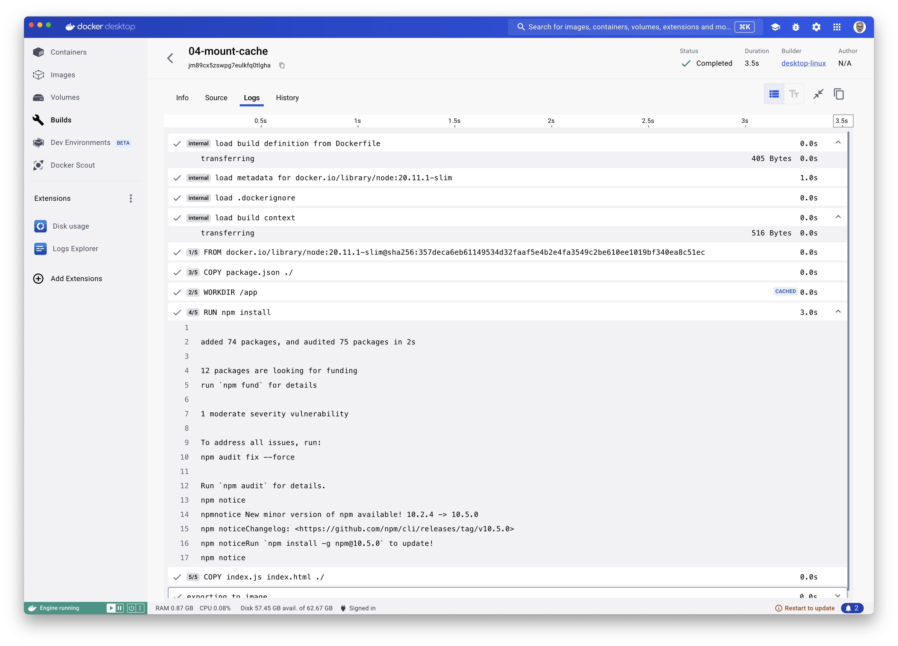
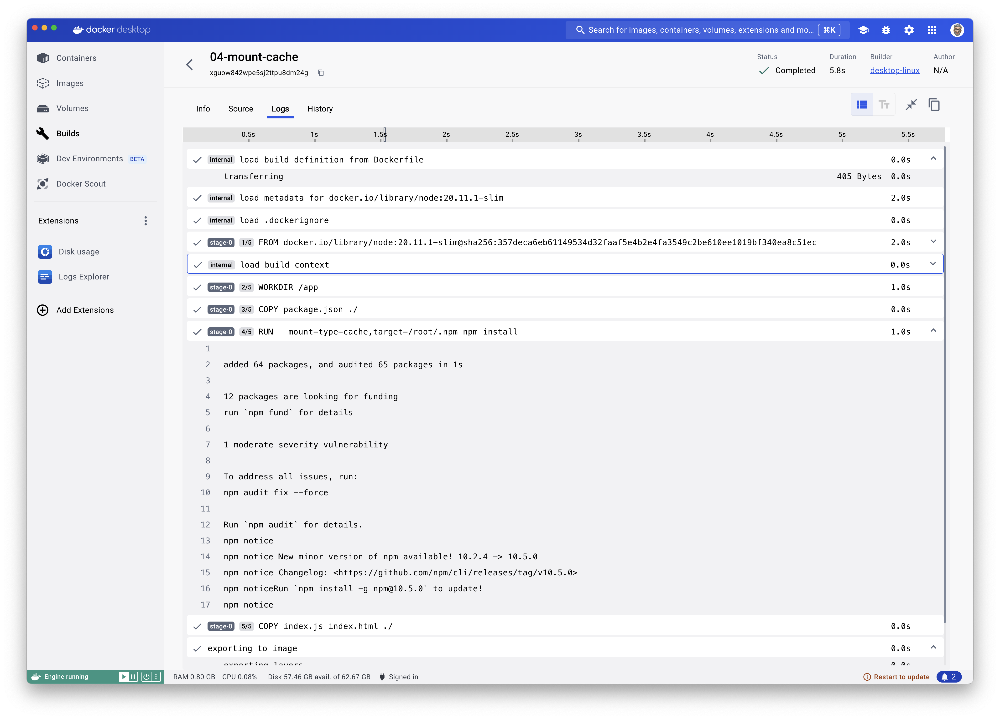
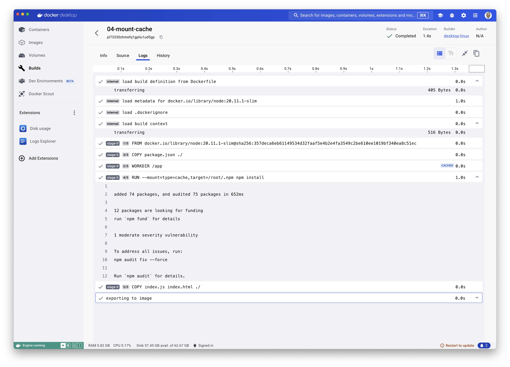

# O4- Add a cache mount

> Use case: Accelerate the download of dependencies

## Without cache

### First build

```Dockerfile
FROM node:20.11.1-slim

WORKDIR /app
COPY package.json ./
RUN npm install

COPY index.js index.html ./

EXPOSE 8080
CMD ["node", "index.js"]
```

```json
{
  "name": "hello-cache",
  "version": "1.0.0",
  "main": "index.js",
  "dependencies": {
    "express": "4.18.2"
  },
  "scripts": {
    "start": "node index.js"
  }
}
```


```bash
docker build -t hello-cache .
```

> 64 packages added | **4.3 secs**


### Second build

- Add the Redis dependency
- Same Dockerfile

```json
{
  "name": "hello-cache",
  "version": "1.0.0",
  "main": "index.js",
  "dependencies": {
    "express": "4.18.2",
    "redis": "^4.6.13"
  },
  "scripts": {
    "start": "node index.js"
  }
}
```

```bash
docker build -t hello-cache .
```

> 74 packages added (npm has download again the express dependencies, then the redis dependencies) | **3.5 secs**



## With cache

### First build

```Dockerfile
FROM node:20.11.1-slim

WORKDIR /app
COPY package.json ./
RUN --mount=type=cache,target=/root/.npm npm install

COPY index.js index.html ./

EXPOSE 8080
CMD ["node", "index.js"]
```

```json
{
  "name": "hello-cache",
  "version": "1.0.0",
  "main": "index.js",
  "dependencies": {
    "express": "4.18.2"
  },
  "scripts": {
    "start": "node index.js"
  }
}
```


```bash
docker build -t hello-cache .
```

> 64 packages added | **5.8 secs**



### Second build

- Add the Redis dependency
- Same Dockerfile

```json
{
  "name": "hello-cache",
  "version": "1.0.0",
  "main": "index.js",
  "dependencies": {
    "express": "4.18.2",
    "redis": "^4.6.13"
  },
  "scripts": {
    "start": "node index.js"
  }
}
```

```bash
docker build -t hello-cache .
```

> 74 packages added | **1.4 secs** 🎉 (npm has download again the express dependencies **but from the cache**, then the redis dependencies)

