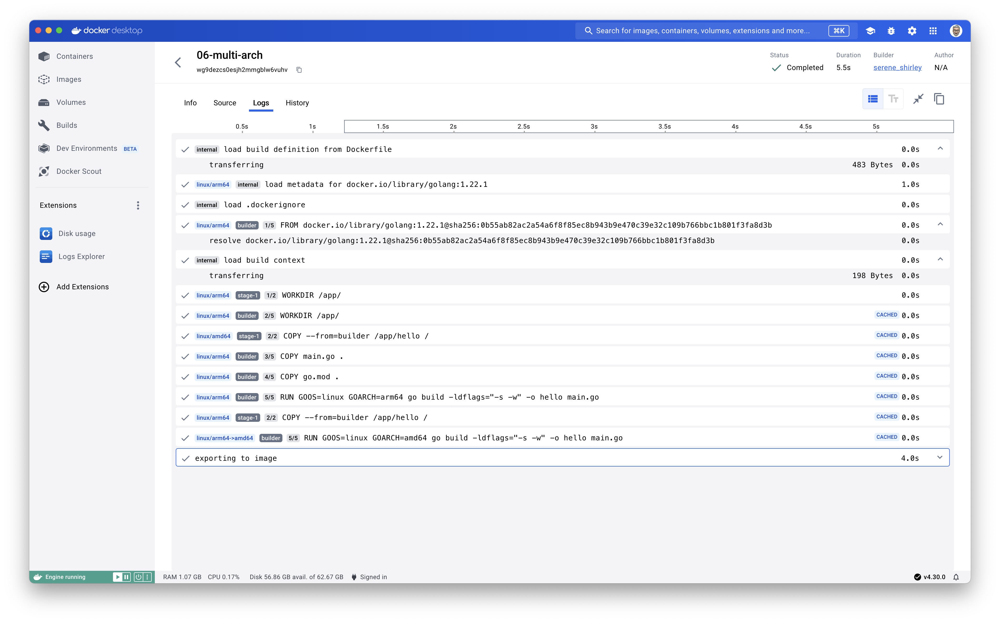

# Build multi architecture

## Docker Buildx

Docker Buildx is an advanced feature provided by Docker that allows you to build Docker images for multiple platforms (like AMD64, ARM64, etc.) from a single command. It's essentially an extension to the Docker CLI that introduces the ability to build, tag, and push images using the BuildKit engine, which provides improved performance, caching, and build capabilities compared to the traditional Docker build process.

In simpler terms, Docker Buildx lets you:

- **Build images for different CPU architectures**: This is really handy if you're developing software that needs to run on different types of hardware, such as both traditional Intel/AMD servers and ARM-based devices like Raspberry Pis or newer Macs.
- **Utilize advanced build features**: It leverages BuildKit, which enhances the building process with features like efficient handling of large numbers of files and parallel builds.
- **Create a single image that works on multiple architectures**: Known as a "multi-architecture image", this is great for distribution since users can pull the same image name and get the appropriate architecture for their system automatically.

Buildx is especially useful in a development world that's increasingly diverse in terms of hardware. It simplifies the process of ensuring your application can run anywhere, from cloud servers to IoT devices, without needing to manage separate build processes for each architecture.

## Example

Create a directory with the following files

```bash
.
├── Dockerfile
├── go.mod
└── main.go
```

### go.mod

```
module hello

go 1.22.1
```

### main.go

```golang
package main

import "fmt"

func main()  {
	fmt.Printf("[Multi Arch] 👋 hello world 🌍\n")
}
```

### Dockerfile

```Dockerfile
FROM --platform=$BUILDPLATFORM golang:1.22.1 as builder

ARG TARGETOS
ARG TARGETARCH

WORKDIR /app/
COPY main.go .
COPY go.mod .

RUN GOOS=${TARGETOS} GOARCH=${TARGETARCH} go build -ldflags="-s -w" -o hello main.go

FROM --platform=$TARGETPLATFORM scratch
WORKDIR /app/
COPY --from=builder /app/hello /
CMD ["/hello"]
```

### Build and Push

Use the following command to build the multiarch image:
```bash
docker buildx build \
--platform=linux/amd64,linux/arm64 \
--push -t philippecharriere494/hello-go:multiarch .
```

> The `--platform` flag informs `buildx` to create Linux images for AMD 64-bit and Arm 64-bit architectures.

Build arguments such as `BUILDPLATFORM` and `TARGETPLATFORM` are automatically available for use in your Dockerfile (from `--platform`)

`TARGETOS` and `TARGETARCH` values are deduced from the values of `--platform`

> If you look at the build history, you can view the values of `GOOS=${TARGETOS} GOARCH=${TARGETARCH}`:


**It is important to know that**: Docker pulls the correct image for the current architecture (and not all the architecture).

## Some refs

- https://www.docker.com/blog/faster-multi-platform-builds-dockerfile-cross-compilation-guide/
- https://docs.docker.com/build/building/multi-platform/