# Images Deep Dive

- First, make temporary folder
- Navigate to this folder,
- And, then git clone this repository: https://github.com/docker-hands-on-exercises/images-deep-dive-next

```bash
git clone https://github.com/docker-hands-on-exercises/images-deep-dive-next.git
```

## 01- Optimize the size of the images

We want to install Python, Pip and Flask on Ubuntu

> 💁 if you don't have the "Builds" menu in the UI of Docker Desktop, at the end of this paragraph, I explain how to get the history of the builds from a terminal

### First build

Navigate to the `00-layers` folder
```bash
cd 00-layers
```

This is the first `Dockerfile`: `Dockerfile.one`

> 👋 change the path of the image after the `FROM` command if you use your own private image registry.
```Dockerfile
FROM ubuntu
RUN apt update
RUN apt install -y python3 python3-pip
RUN pip install flask
RUN apt autoremove --purge -y python3-pip
RUN rm -f /var/lib/lists
```

**Build the image**: 

```bash
docker build -t hello-python:one -f Dockerfile.one . 
```

> Go to the **Builds** view and click on the `00-layers/Dockerfile.one` build
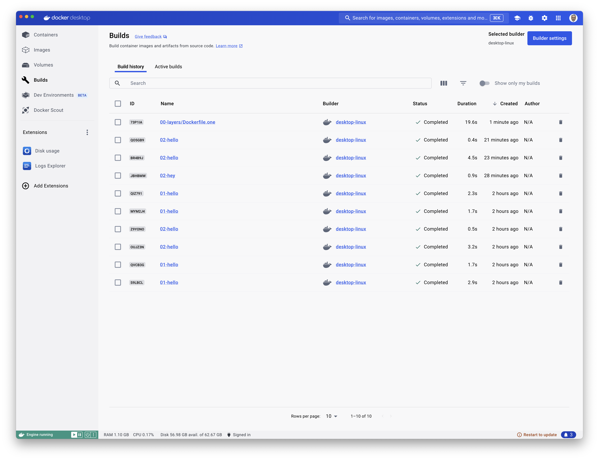

> There is a layer per `RUN` command
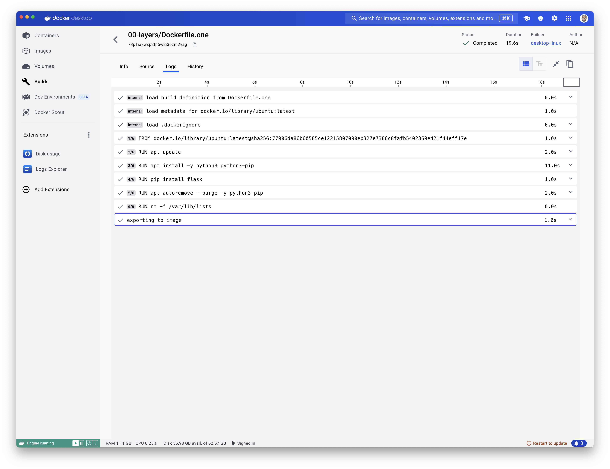
> Check the size of the image in the **Images** section

The layers related to the installation are already created. So, the "purge" layer is useless.

Now, let's try with another `Dockerfile`

### Second build

This is the second `Dockerfile`: `Dockerfile.two`

> 👋 change the path of the image after the `FROM` command if you use your own private image registry.
```Dockerfile
FROM ubuntu
RUN apt update && \
    apt install -y python3 python3-pip && \
    pip install flask && \
    apt autoremove --purge -y python3-pip && \
    rm -f /var/lib/lists
```
**✋ this time we used only one `RUN` command**

**Build the image**: 

```bash
docker build -t hello-python:two -f Dockerfile.two . 
```

> Go to the **Builds** view and click on the `00-layers/Dockerfile.two` build
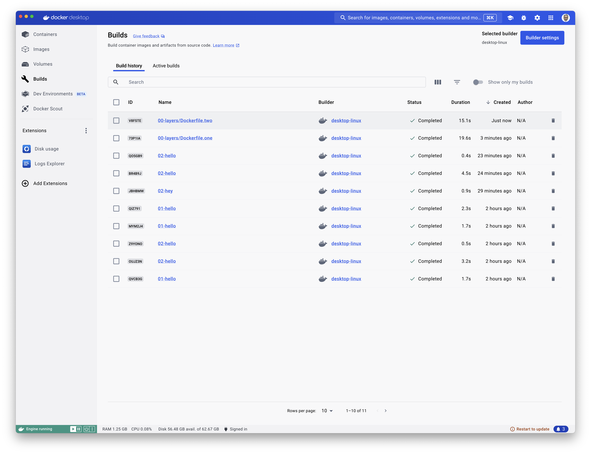

> There is only one `RUN` layer
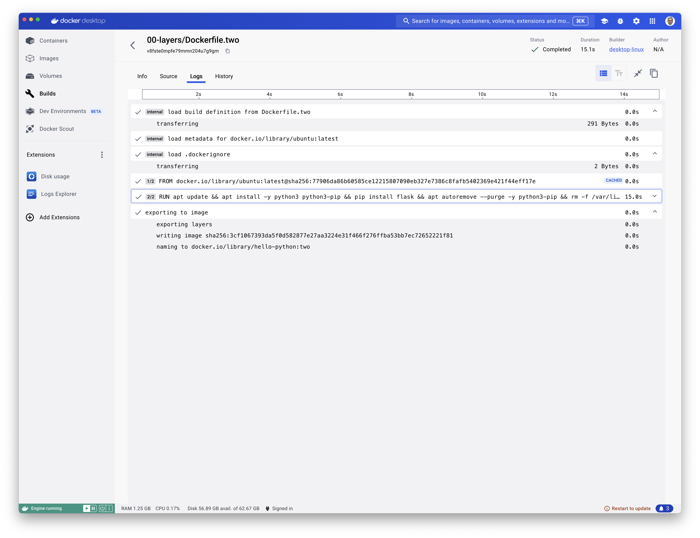
> Check the size of the image in the **Images** section

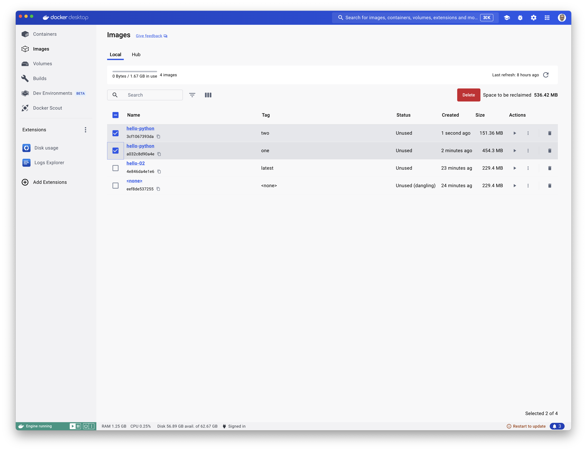

We run all the installation steps, and then the purge step, and than the layer was created. It's why we gained some space.

## Get the build history with the CLI

```bash
docker history --format "table {{.CreatedBy}}\t{{.Size}}" hello-python:one
# Get the size of the image
docker images | grep hello-python

docker history --format "table {{.CreatedBy}}\t{{.Size}}" hello-python:two
# Get the size of the two images
docker images | grep hello-python
```

You should get the following results:

```bash
docker history --format "table {{.CreatedBy}}\t{{.Size}}" hello-python:one

CREATED BY                                      SIZE
RUN /bin/sh -c rm -f /var/lib/lists # buildk…   0B
RUN /bin/sh -c apt autoremove --purge -y pyt…   1.73MB
RUN /bin/sh -c pip install flask # buildkit     4.64MB
RUN /bin/sh -c apt install -y python3 python…   333MB
RUN /bin/sh -c apt update # buildkit            45.7MB
/bin/sh -c #(nop)  CMD ["/bin/bash"]            0B
/bin/sh -c #(nop) ADD file:07cdbabf782942af0…   69.2MB
/bin/sh -c #(nop)  LABEL org.opencontainers.…   0B
/bin/sh -c #(nop)  LABEL org.opencontainers.…   0B
/bin/sh -c #(nop)  ARG LAUNCHPAD_BUILD_ARCH     0B
/bin/sh -c #(nop)  ARG RELEASE                  0B
```

```bash
docker history --format "table {{.CreatedBy}}\t{{.Size}}" hello-python:two

CREATED BY                                      SIZE
RUN /bin/sh -c apt update &&     apt install…   82.1MB
/bin/sh -c #(nop)  CMD ["/bin/bash"]            0B
/bin/sh -c #(nop) ADD file:07cdbabf782942af0…   69.2MB
/bin/sh -c #(nop)  LABEL org.opencontainers.…   0B
/bin/sh -c #(nop)  LABEL org.opencontainers.…   0B
/bin/sh -c #(nop)  ARG LAUNCHPAD_BUILD_ARCH     0B
/bin/sh -c #(nop)  ARG RELEASE                  0B
```

```bash
docker images | grep hello-python

hello-python   two       e505d3cc01f3   20 minutes ago   151MB
hello-python   one       a866994d8bdf   24 minutes ago   454MB
```

## 02- Accelerate the build of the images

> The order of the commands in a Dockerfile is important

> 💁 if you don't have the "Builds" menu in the UI of Docker Desktop, you can simply read the progress of the build into the terminal

### Hello 01

Navigate to the `01-hello` folder
```bash
cd 01-hello
```

This is the `Dockerfile` of the web application:

> 👋 change the path of the image after the `FROM` command if you use your own private image registry.
```Dockerfile
FROM node:20.11.1-slim

WORKDIR /app
COPY . .
RUN npm install

EXPOSE 8080
CMD ["node", "index.js"]
```

#### First Build

**Build the image**: 

```bash
docker build -t hello-01 .
```

Launch the GUI of Docker Desktop:

> Go to the **Builds** view and click on the `01-hello` build
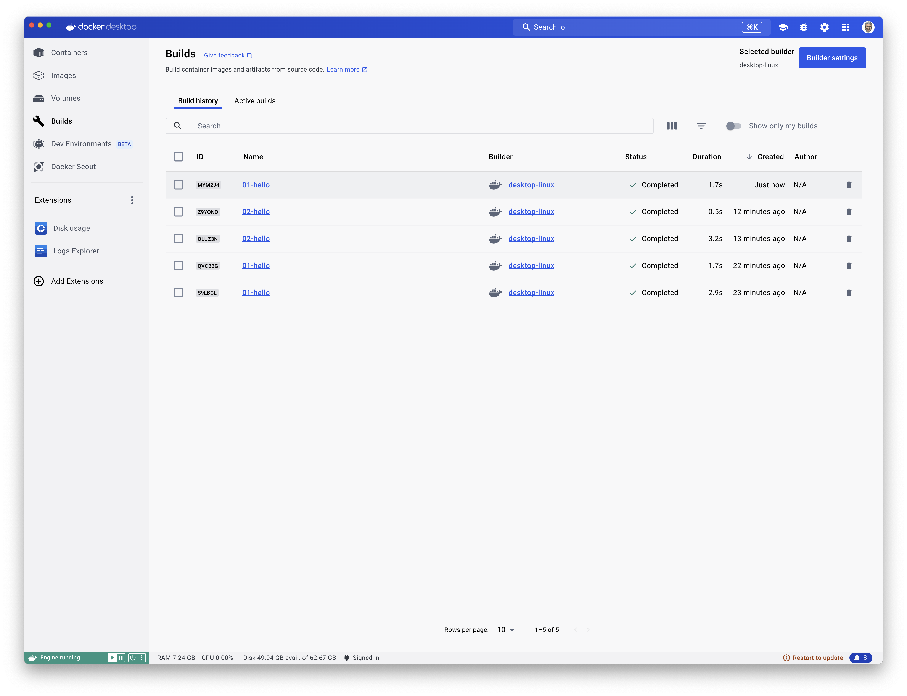

> Click on the **Logs** tab:
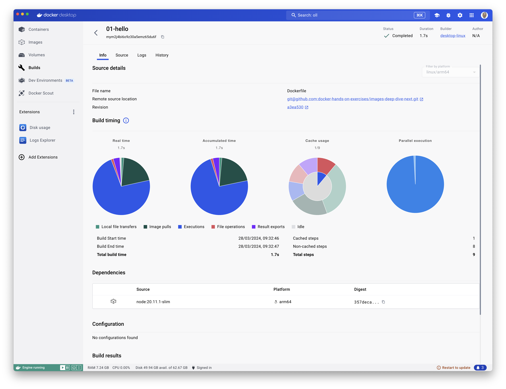

> Then you can see the the logs of the build


#### Second build

Change something or add content in the source code of the `index.html` file.

**Build again the image**: 

```bash
docker build -t hello-01 .
```

If you go back to the GUI of Docker Desktop:

> You can see a new `01-hello` build
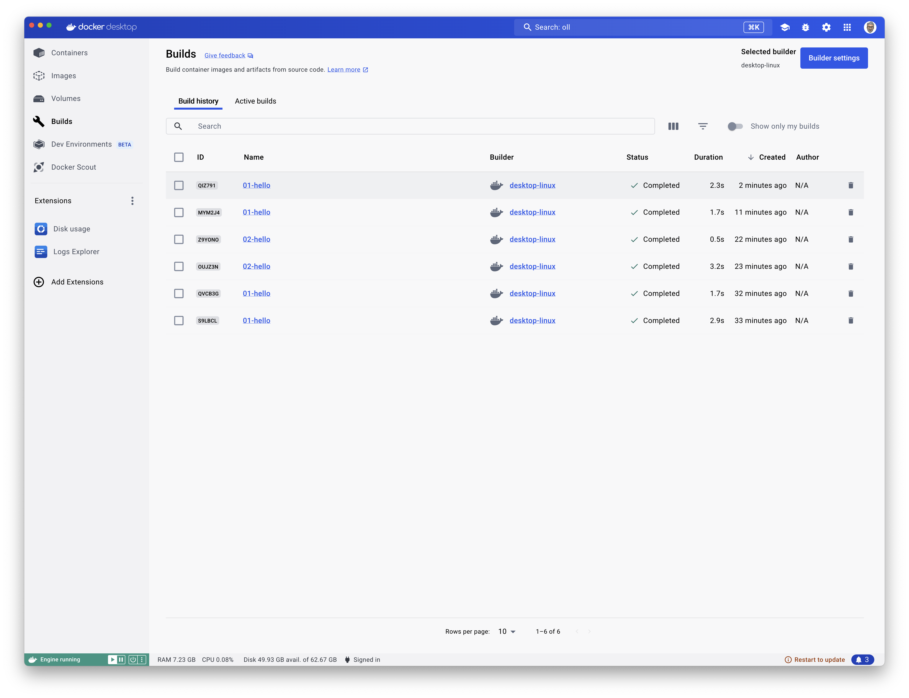

> Click on it, and go to the **Logs** tab:
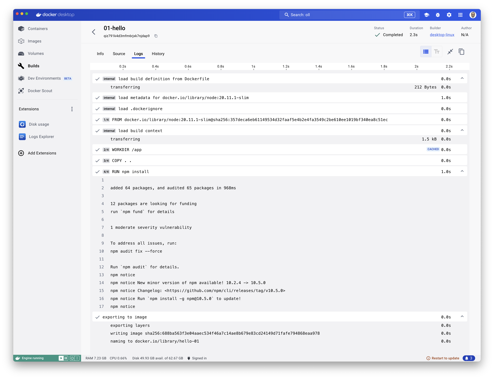

- The logs are pretty similar to the previous logs
- The build time is not better

**Every time you change something in your project, everything at the build will be done again**.

### Hello 02

Navigate to the `02-hello` folder
```bash
cd 02-hello
```

This is the `Dockerfile` of the web application:

> 👋 change the path of the image after the `FROM` command if you use your own private image registry.
```Dockerfile
FROM node:20.11.1-slim

WORKDIR /app
COPY package.json ./
RUN npm install

COPY index.js index.html ./

EXPOSE 8080
CMD ["node", "index.js"]
```

- ✋ **I split the previous `COPY` command into 2 `COPY` commands**
- First, I copy the `package.json` file and run a `npm install`
- Then, I copy the source code of the application

#### First Build

**Build the image**: 

```bash
docker build -t hello-02 .
```

Launch the GUI of Docker Desktop:

> You can see a new `02-hello` build
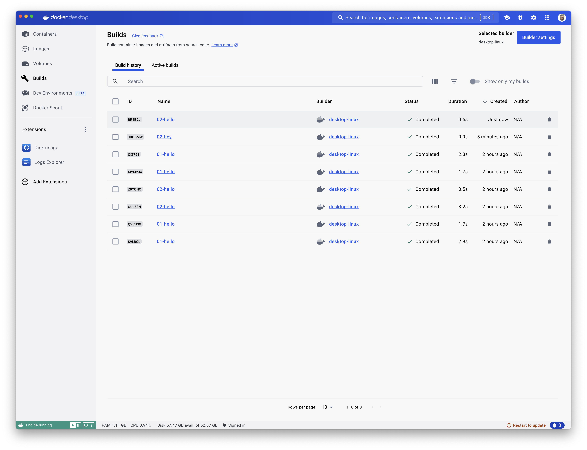

> Click on it, and go to the **Logs** tab:
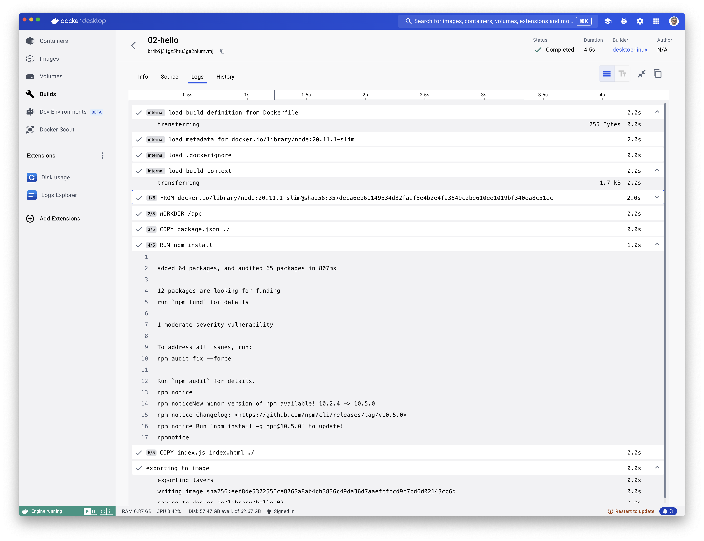

You can see all the logs of the build

#### Update the source code and run the second build

Change something or add content in the source code of the `index.html` file.

**Build again the image**: 

```bash
docker build -t hello-02 .
```

If you go back to the GUI of Docker Desktop:

> You can see a new `02-hello` build
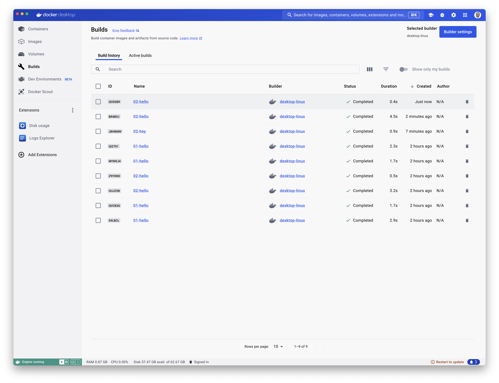

**✋ you can see that it is a lot faster than the previous one**.

> Click on it, and go to the **Logs** tab:
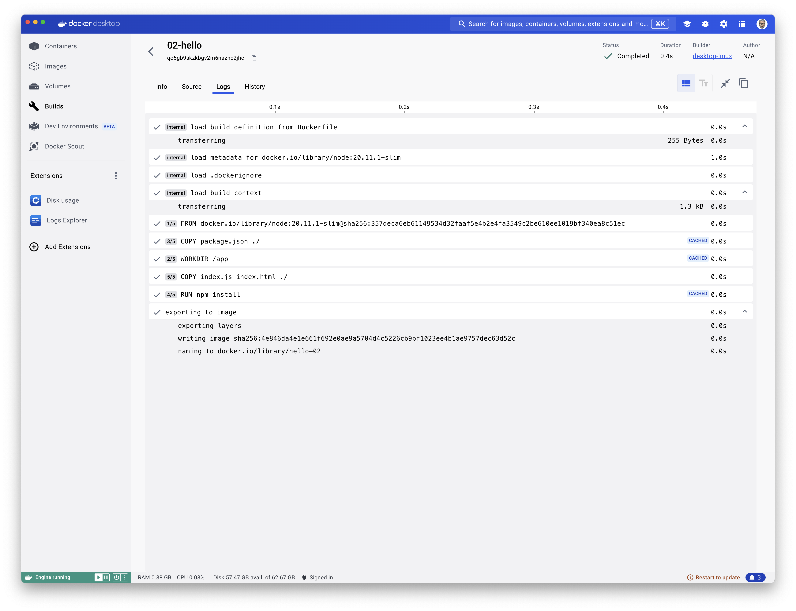

**✋ you can see that all the layers related to the dependencies are in the cache**.

> Go to the **Histroy** tab to get a graphical view of the progress of the builds:
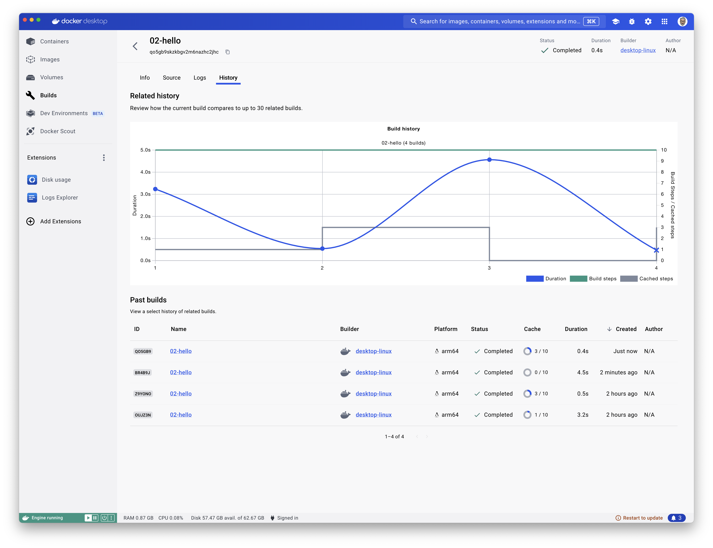

## 03- Multi-stage builds

We want to "dockerize" a Golang application

### First try

This is the `Dockerfile` of the go application: `Dockerfile.golang`

> 👋 change the path of the image after the `FROM` command if you use your own private image registry.
```Dockerfile
FROM golang
COPY main.go .
COPY go.mod .
# it will produce a hello binary
RUN go build 
CMD ["./hello"]
```

**Build the image**: 

```bash
docker build -t hello-go:golang -f Dockerfile.golang . 
```

Launch the GUI of Docker Desktop and check the size of the image and the logs of the build.


### Second try with 2 stages

This is the `Dockerfile` of the go application: `Dockerfile.ubuntu`

> 👋 change the path of the image after the `FROM` command if you use your own private image registry.
```Dockerfile
FROM golang as builder
COPY main.go .
COPY go.mod .
RUN go build

FROM ubuntu
COPY --from=builder /go/hello .
CMD ["./hello"]
```
- The first stage use the golang image to build the application
- The second stage copy the binary into an ubuntu image

**Build the image**: 

```bash
docker build -t hello-go:ubuntu -f Dockerfile.ubuntu .
```

Launch the GUI of Docker Desktop and check the size of the image and the logs of the build.


### Third try with 2 stages and a scratch image
> A scratch image is an empty image.

This is the `Dockerfile` of the go application: `Dockerfile.scratch`

> 👋 change the path of the image after the `FROM` command if you use your own private image registry.
```Dockerfile
FROM golang as builder
COPY main.go .
COPY go.mod .
RUN go build 

FROM scratch
COPY --from=builder /go/hello .
CMD ["./hello"]
```

**Build the image**: 

```bash
docker build -t hello-go:scratch -f Dockerfile.scratch . 
```

Launch the GUI of Docker Desktop and check the size of the image and the logs of the build.

Try this command:

```bash
docker images | grep hello-go
```

The result is:

```bash
hello-go       scratch   473f6fa42148   2 minutes ago       1.95MB
hello-go       ubuntu    59ebdecd616f   3 minutes ago       71.2MB
hello-go       golang    825a7526a8f5   5 minutes ago       860MB
```
